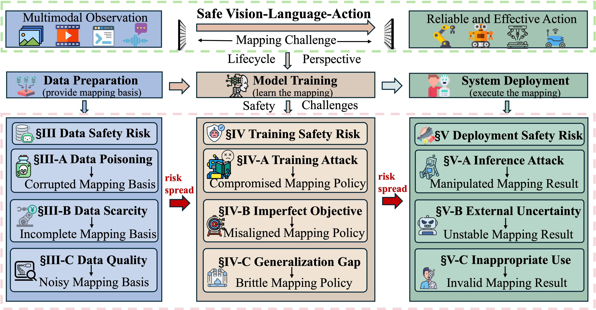

# VLA Safety Papers

[](https://github.com/sindresorhus/awesome)


---

This repository provides a **comprehensive and structured resource** for VLA safety, based on our survey:   
📄 **[Safety of Vision-Language-Action Models: A Survey from Lifecycle Perspectives](https://www.authorea.com/doi/full/10.22541/au.177524426.60806944/v1)**  

**Vision-Language-Action (VLA) models** enable embodied agents to perceive, reason, and act in real-world environments through unified end-to-end multimodal policies.  
As VLA models are increasingly deployed in real-world environments, **ensuring their safety has become a critical concern**, as failures or malicious behaviors may lead to severe physical harm and broader societal consequences.

**The Scope of Safety in This Survey.**
In this repository, safety refers to the ability to avoid unintended, harmful, or unsafe outcomes throughout the lifecycle of the VLA system. 
This includes not only preventing incorrect or unsafe behaviors during task execution, but also mitigating risks (e.g., privacy, ethics, and other broader impacts on humans, environemtns, and society) during the development of the system.
From this perspective, safety encompasses two key aspects: security and reliability. 


## 📢 Latest Updates

[29/03/2026] Repo initialized.  
  

---

## 🤝 Contribution

We welcome contributions to improve this repository!

If you have relevant papers, feel free to submit a pull request:

```
| venue'year | [paper_name](link) | Authors | [[code]](code_link) |
```

---

## 📚 Contents

- [Relevant Survey](#-relevant-survey)
- [Taxonomy](#-taxonomy)
- [Data Safety](#-data-safety)
- [Training Safety](#-training-safety)
- [Deployment Safety](#-deployment-safety)
- [Contact](#-contact)

---

## 📄 Relevant Survey

| Venue | Title | Year | Authors | Code |
| - | - | - | - | - |
| Preprint | [Safety of Vision-Language-Action Models: A Comprehensive Survey](#) | 2026 | Yuan et al. | [Link](https://github.com/hi-weiyuan/VLA-Safety-Papers)
| Preprint | [Vision-Language-Action (VLA) Models: Concepts, Progress, Applications and Challenges](https://arxiv.org/abs/2505.04769) | 2025 | Sapkota et al. | [Link](https://github.com/Applied-AI-Research-Lab/Vision-Language-Action-Models-Concepts-Progress-Applications-and-Challenges)
| Preprint | [Large VLM-based Vision-Language-Action Models for Robotic Manipulation: A Survey](https://arxiv.org/abs/2508.13073) | 2025 | Shao et al. | [Link](https://github.com/JiuTian-VL/Large-VLM-based-VLA-for-Robotic-Manipulation)
| Preprint | [Parallels Between VLA Model Post-Training and Human Motor Learning: Progress, Challenges, and Trends](https://arxiv.org/abs/2506.20966) | 2025 | Xiang et al. | [Link](https://github.com/AoqunJin/Awesome-VLA-Post-Training)
| Preprint | [A Survey on Vision-Language-Action Models: An Action Tokenization Perspective](https://arxiv.org/abs/2507.01925) | 2025 | Zhong et al. | None
| Preprint | [Vision Language Action Models in Robotic Manipulation: A Systematic Review](https://arxiv.org/abs/2507.10672) | 2025 | Din et al. | [Link](https://github.com/Muhayyuddin/VLAs)
| Preprint | [Pure vision language action (vla) models: A comprehensive survey](https://arxiv.org/abs/2509.19012) | 2025 | Zhang et al. | None
| Preprint | [A Survey on Efficient Vision-Language-Action Models](https://arxiv.org/abs/2510.24795) | 2025 | Yu et al. | [Link](https://evla-survey.github.io/)
| Preprint | [A Survey on Vision-Language-Action Models for Autonomous Driving](https://arxiv.org/abs/2506.24044) | 2025 | Jiang et al. | [Link](https://github.com/JohnsonJiang1996/Awesome-VLA4AD)
| IEEE Access | [Vision-Language-Action Models for Robotics: A Review Towards Real-World Applications](https://arxiv.org/abs/2510.07077) | 2025 | Kawaharazuka et al. | [Link](https://vla-survey.github.io/)
| Preprint | [A Survey on Vision-Language-Action Models for Embodied AI](https://arxiv.org/abs/2405.14093) | 2024 | Ma et al. | [Link](https://github.com/yueen-ma/Awesome-VLA)


---

## 🧠 Taxonomy

We organize VLA safety from a **lifecycle perspective**:

- **Data Preparation → Data Safety**
- **Model Training → Training Safety**
- **System Deployment → Deployment Safety**

Each stage is further divided into:

- 🔴 **Adversarial Scenarios**
- 🟢 **Non-adversarial Scenarios**  

The following figure shows lifecycle-oriented taxonomy of our VLA safety survey.
<p align="center">
  <figure>
    
    <!-- <figcaption> A lifecycle-oriented taxonomy of VLA safety.</figcaption> -->
  </figure>
</p>

---


# 🗂 Data Safety

## Adversarial Scenarios
### Training Data Poisoning  
| Venue | Title | Year | Authors | Code |
| - | - | - | - | - |
| Preprint | [SilentDrift: Exploiting Action Chunking for Stealthy Backdoor Attacks on Vision-Language-Action Models](https://arxiv.org/abs/2601.14323) | 2026 | Xu et al. | None
| Preprint | [Inject Once Survive Later: Backdooring Vision-Language-Action Models to Persist Through Downstream Fine-tuning](https://arxiv.org/abs/2602.00500) | 2026 | Zhou et al. | [Link](https://jianyi2004.github.io/infuse-vla-backdoor/)
| Preprint | [State Backdoor: Towards Stealthy Real-world Poisoning Attack on Vision-Language-Action Model in State Space](https://arxiv.org/abs/2601.04266) | 2026 | Guo et al. | None
| Preprint | [DropVLA: An Action-Level Backdoor Attack on Vision-Language-Action Models](https://arxiv.org/abs/2510.10932) | 2025 | Xu et al. | [Link](https://github.com/megaknight114/DropVLA)
| Preprint | [AttackVLA: Benchmarking Adversarial and Backdoor Attacks on Vision-Language-Action Models](https://arxiv.org/abs/2511.12149) | 2025 | Li et al. | None
| Preprint | [Clean-Action Backdoor Attacks on Vision-Language-Action Models via Sequential Error Exploitation](https://openreview.net/pdf?id=QQdn8nNqgi) | 2025 | Yang et al. | None
| NIPS | [BadVLA: Towards Backdoor Attacks on Vision-Language-Action Models via Objective-Decoupled Optimization](https://openreview.net/forum?id=rEhVHla9zp) | 2025 | Zhou et al. | [Link](https://github.com/Zxy-MLlab/BadVLA)
| Preprint | [Goal-oriented Backdoor Attack against Vision-Language-Action Models via Physical Objects](https://arxiv.org/abs/2510.09269) | 2025 | Zhou et al. | [Link](https://goba-attack.github.io/)

### Training Data Privacy  
| Venue | Title | Year | Authors | Code |
| - | - | - | - | - |
| Preprint | [pFedNavi: Structure-Aware Personalized Federated Vision-Language Navigation for Embodied AI](https://arxiv.org/abs/2602.14401) | 2026 | Yang et al. | None
| Agentic AI | [Agentic Surgical AI: Surgeon Style Fingerprinting and Privacy Risk Quantification via Discrete Diffusion in a Vision-Language-Action Framework](https://link.springer.com/chapter/10.1007/978-3-032-06004-4_2) | 2025 | Zhan et al. | [Link](https://github.com/huixin-zhan-ai/Surgeon_style_fingerprinting)
| ICCV | [Fedvla: Federated vision-language-action learning with dual gating mixture-of-experts for robotic manipulation](https://arxiv.org/abs/2508.02190) | 2025 | Miao et al. | None

## Non-adversarial Scenarios
### Data Scarcity  
| Venue | Title | Year | Authors | Code |
| - | - | - | - | - |
| CVPR | [World-Env: Leveraging World Model as a Virtual Environment for VLA Post-Training](https://arxiv.org/abs/2509.24948) | 2026 | Xiao et al. | [Link](https://github.com/amap-cvlab/world-env)
| ICLR | [Learning Video Generation for Robotic Manipulation with Collaborative Trajectory Control](https://arxiv.org/abs/2506.01943) | 2026 | Fu et al. | [Link](https://fuxiao0719.github.io/projects/robomaster/)
| ICLR | [EgoDex: Learning Dexterous Manipulation from Large-Scale Egocentric Video](https://arxiv.org/abs/2505.11709) | 2026 | Hoque et al. | [Link](https://github.com/apple/ml-egodex)
| Preprint | [Genie Centurion: Accelerating Scalable Real-World Robot Training with Human Rewind-and-Refine Guidance](https://arxiv.org/abs/2505.18793) | 2025 | Wang et al. | [Link](https://genie-centurion.github.io/)
| CoRL | [GraspVLA: a Grasping Foundation Model Pre-trained on Billion-scale Synthetic Action Data](https://openreview.net/forum?id=zEC8TOXDkH#discussion) | 2025 | Deng et al. | [Link](https://pku-epic.github.io/GraspVLA-web/)
| CoRL | [Real2Render2Real: Scaling Robot Data Without Dynamics Simulation or Robot Hardware](https://arxiv.org/abs/2505.09601) | 2025 | Yu et al. | [Link](https://real2render2real.com/)
| Preprint | [RoboTwin 2.0: A Scalable Data Generator and Benchmark with Strong Domain Randomization for Robust Bimanual Robotic Manipulation](https://arxiv.org/abs/2506.18088) | 2025 | Chen et al. | [Link](https://robotwin-platform.github.io/)
| IROS | [ReBot: Scaling Robot Learning with Real-to-Sim-to-Real Robotic Video Synthesis](https://arxiv.org/abs/2503.14526) | 2025 | Fang et al. | [Link](https://yuffish.github.io/rebot/)
| Preprint | [SimpleVLA-RL: Scaling VLA Training via Reinforcement Learning](https://arxiv.org/abs/2509.09674) | 2025 | Li et al. | [Link](https://github.com/PRIME-RL/SimpleVLA-RL)
| Preprint | [VLA-RFT: Vision-Language-Action Reinforcement Fine-tuning with Verified Rewards in World Simulators](https://arxiv.org/abs/2510.00406) | 2025 | Li et al. | [Link](https://vla-rft.github.io/)
| Preprint | [EgoVLA: Learning Vision-Language-Action Models from Egocentric Human Videos](https://arxiv.org/abs/2507.12440) | 2025 | Yang et al. | [Link](https://rchalyang.github.io/EgoVLA)
| Preprint | [Being-H0: Vision-Language-Action Pretraining from Large-Scale Human Videos](https://arxiv.org/abs/2507.15597) | 2025 | Luo et al. | [Link](https://beingbeyond.github.io/Being-H0)
| Preprint | [MimicDreamer: Aligning Human and Robot Demonstrations for Scalable VLA Training](https://arxiv.org/abs/2507.15597) | 2025 | Li et al. | [Link](https://mimicdreamer.github.io/)
| Preprint | [AR-VRM: Imitating Human Motions for Visual Robot Manipulation with Analogical Reasoning](https://arxiv.org/abs/2508.07626) | 2025 | Yang et al. | [Link](https://github.com/idejie/ar)
| RSS | [Universal Manipulation Interface: In-The-Wild Robot Teaching Without In-The-Wild Robots](https://arxiv.org/abs/2507.15597) | 2024 | Chi et al. | [Link](https://umi-gripper.github.io/)

### Data Quality  
| Venue | Title | Year | Authors | Code |
| - | - | - | - | - |
|IEEE RA-L | [PointVLA: Injecting the 3D World Into Vision-Language-Action Models](https://arxiv.org/abs/2503.07511) | 2026 | Li et al. | [Link](https://pointvla.github.io/)
| Preprint | [SpatialVLA: Exploring Spatial Representations for Visual-Language-Action Model](https://arxiv.org/abs/2501.15830) | 2025 | Qu et al. | [Link](https://spatialvla.github.io/)
| RSS | [CLIP-RT: Learning Language-Conditioned Robotic Policies from Natural Language Supervision](https://arxiv.org/abs/2411.00508) | 2025 | Kang et al. | [Link](https://clip-rt.github.io/)
| ICML | [ReinboT: Amplifying Robot Visual-Language Manipulation with Reinforcement Learning](https://proceedings.mlr.press/v267/zhang25dr.html) | 2025 | Zhang et al. | None
| Preprint | [VLA-RFT: Vision-Language-Action Reinforcement Fine-tuning with Verified Rewards in World Simulators](https://arxiv.org/abs/2510.00406) | 2025 | Li et al. | [Link](https://vla-rft.github.io/)
| IROS | [ReBot: Scaling Robot Learning with Real-to-Sim-to-Real Robotic Video Synthesis](https://arxiv.org/abs/2503.14526) | 2025 | Fang et al. | [Link](https://yuffish.github.io/rebot/)
| ICCV | [RoboPearls: Editable Video Simulation for Robot Manipulation](https://arxiv.org/abs/2506.22756) | 2025 | Tang et al. | None
| ICCV | [VQ-VLA: Improving Vision-Language-Action Models via Scaling Vector-Quantized Action Tokenizers](https://arxiv.org/abs/2507.01016) | 2025 | Wang et al. | [Link](https://xiaoxiao0406.github.io/vqvla.github.io)
| Preprint | [MimicDreamer: Aligning Human and Robot Demonstrations for Scalable VLA Training](https://arxiv.org/abs/2507.15597) | 2025 | Li et al. | [Link](https://mimicdreamer.github.io/)
| CVPR | [EmbodiedScan: A Holistic Multi-Modal 3D Perception Suite Towards Embodied AI](https://openaccess.thecvf.com/content/CVPR2024/html/Wang_EmbodiedScan_A_Holistic_Multi-Modal_3D_Perception_Suite_Towards_Embodied_AI_CVPR_2024_paper.html) | 2024 | Wang et al. | [Link](https://github.com/OpenRobotLab/EmbodiedScan)


---

# 📈 Training Safety

## Adversarial Scenarios
### Pretraining-Inherited & Finetuning Risks  
Note: most data poisoning attacks need to revise the training process to strengthen their adversarial effects. Therefore, this part may have large overlaps with [Training Data Poisoning](#training-data-poisoning).

| Venue | Title | Year | Authors | Code |
| - | - | - | - | - |
| AAAI | [Phantom Menace: Exploring and Enhancing the Robustness of VLA Models Against Physical Sensor Attacks](https://arxiv.org/abs/2511.12149) | 2026 | Lu et al. | [Link](https://github.com/ZJUshine/Phantom-Menace)
|Preprint | [FreezeVLA: Action-Freezing Attacks against Vision-Language-Action Models](https://arxiv.org/abs/2509.19870) | 2025 | Wang et al. | [Link](https://github.com/xinwong/FreezeVLA)
| Preprint | [AttackVLA: Benchmarking Adversarial and Backdoor Attacks on Vision-Language-Action Models](https://arxiv.org/abs/2511.12149) | 2025 | Li et al. | None
| ICML | [Safety Fine-Tuning at (Almost) No Cost: A Baseline for Vision Large Language Models](https://arxiv.org/abs/2402.02207) | 2024 | Zong et al. | [Link](https://github.com/ys-zong/VLGuard)
| NIPS | [Backdooralign: Mitigating fine-tuning based jailbreak attack with backdoor enhanced safety alignment](https://proceedings.neurips.cc/paper_files/paper/2024/hash/094324f386c836c75d4a26f3499d2ede-Abstract-Conference.html) | 2024 | Wang et al. | None


## Non-adversarial Scenarios
### Inappropriate Objective Design  
| Venue | Title | Year | Authors | Code |
| - | - | - | - | - |
| AAAI | [Continuous Vision-Language-Action Co-Learning with Semantic-Physical Alignment for Behavioral Cloning](https://ojs.aaai.org/index.php/AAAI/article/view/39677) | 2026 | Renz et al. | [Link](https://qhemu.github.io/CCoL/)
| ICASSP | [CARE: Multi-Task Pretraining for Latent Continuous Action Representation in Robot Control](https://arxiv.org/abs/2601.22467) | 2026 | Shi et al. | None
| CVPR | [SimLingo: Vision-Only Closed-Loop Autonomous Driving with Language-Action Alignment](https://arxiv.org/abs/2503.09594) | 2025 | Renz et al. | None
| Preprint | [VL-SAFE: Vision-Language Guided Safety-Aware Reinforcement Learning with World Models for Autonomous Driving](https://arxiv.org/abs/2505.16377) | 2025 | Qu et al. | [Link](https://ys-qu.github.io/vlsafe-website/)
| NIPS | [Safevla: Towards safety alignment of vision-language-action model via constrained learning](https://arxiv.org/abs/2503.03480) | 2025 | Zhang et al. | [Link](https://pku-safevla.github.io/)
| Preprint | [VLSA: Vision-Language-Action Models with Plug-and-Play Safety Constraint Layer](https://arxiv.org/abs/2512.11891) | 2025 | Hu et al. | [Link](https://vlsa-aegis.github.io/)
| Preprint | [A framework for benchmarking and aligning task-planning safety in llm-based embodied agents](https://arxiv.org/abs/2504.14650) | 2025 | Huang et al. | None
| ICRA | [GRAPE: Generalizing Robot Policy via Preference Alignment](https://openreview.net/pdf?id=W64vwmZHdK) | 2025 | Huang et al. | None

### Generalization Gap  
| Venue | Title | Year | Authors | Code |
| - | - | - | - | - |
| NMI | [What matters in building vision–language–action models for generalist robots](https://ieeexplore.ieee.org/abstract/document/11128823) | 2026 | Li et al. | [Link](http://robovlms.github.io/)
| Preprint | [VLA Knows Its Limits](https://arxiv.org/abs/2510.25616) | 2026 | Wang et al. | [Link](https://hatchetproject.github.io/autohorizon/)
| ICLR | [Sim2Real VLA: Zero-Shot Generalization of Synthesized Skills to Realistic Manipulation](https://openreview.net/forum?id=H4SyKHjd4c) | 2026 | Zhao et al. | [Link](https://github.com/DexForce/EmbodiChain)
| Preprint | [SpatialVLA: Exploring Spatial Representations for Visual-Language-Action Model](https://arxiv.org/abs/2501.15830) | 2025 | Qu et al. | [Link](https://spatialvla.github.io/)
| Preprint | [Don't Blind Your VLA: Aligning Visual Representations for OOD Generalization](https://arxiv.org/abs/2510.25616) | 2025 | Kachaev et al. | [Link](https://blind-vla-paper.github.io/)
| Preprint | [LoHoVLA: A Unified Vision-Language-Action Model for Long-Horizon Embodied Tasks](https://arxiv.org/abs/2506.00411) | 2025 | Yang et al. | None
| CoRL | [Long-VLA: Unleashing Long-Horizon Capability of Vision Language Action Model for Robot Manipulation](https://proceedings.mlr.press/v305/fan25a.html) | 2025 | Fan et al. | [Link](https://long-vla.github.io/)
| Preprint | [SeqVLA: Sequential Task Execution for Long-Horizon Manipulation with Completion-Aware Vision-Language-Action Model](https://arxiv.org/abs/2509.14138) | 2025 | Yang et al. | None
| IROS | [ReBot: Scaling Robot Learning with Real-to-Sim-to-Real Robotic Video Synthesis](https://arxiv.org/abs/2503.14526) | 2025 | Fang et al. | [Link](https://yuffish.github.io/rebot/)
| Preprint | [Embodiment Transfer Learning for Vision-Language-Action Models](https://arxiv.org/abs/2511.01224) | 2025 | Li et al. | [Link](https://et-vla.github.io/)
| NIPS | [VidMan: Exploiting Implicit Dynamics from Video Diffusion Model for Effective Robot Manipulation](https://arxiv.org/abs/2411.09153) | 2024 | Wen et al. | None

---

# 🚀 Deployment Safety

## Adversarial Scenarios
### Deployment-Time Attacks  
| Venue | Title | Year | Authors | Code |
| - | - | - | - | - |
| AAAI | [Phantom Menace: Exploring and Enhancing the Robustness of VLA Models Against Physical Sensor Attacks](https://arxiv.org/abs/2511.12149) | 2026 | Lu et al. | [Link](https://github.com/ZJUshine/Phantom-Menace)
| ICRA | [Jailbreaking llm-controlled robots](https://arxiv.org/abs/2411.09153) | 2025 | Robey et al. | [Link](https://robopair.org)
| CVPR | [Phoenix: A Motion-based Self-Reflection Framework for Fine-grained Robotic Action Correction](https://arxiv.org/abs/2504.14588) | 2025 | XIa et al. | [Link](https://github.com/GeWu-Lab/Motion-based-Self-Reflection-Framework)
| ICLR | [BadRobot: Jailbreaking Embodied LLM Agents in the Physical World](https://openreview.net/forum?id=ei3qCntB66) | 2025 | Zhang et al. | [Link](https://embodied-llms-safety.github.io/)
| NIPS | [SAFE: Multitask Failure Detection for Vision-Language-Action Models](https://openreview.net/forum?id=XPyAukgsFf) | 2025 | Gu et al. | [Link](https://vla-safe.github.io/)
| Preprint | [Adversarial attacks on robotic vision language action models](https://arxiv.org/abs/2506.03350) | 2025 | Jones et al. | [Link](https://github.com/eliotjones1/robogcg)
| Preprint | [ANNIE: Be Careful of Your Robots](https://arxiv.org/abs/2506.03350) | 2025 | Huang et al. | [Link](https://github.com/RLCLab/Annie)
| ICCV | [Exploring the adversarial vulnerabilities of vision-language-action models in robotics](https://openaccess.thecvf.com/content/ICCV2025/html/Wang_Exploring_the_Adversarial_Vulnerabilities_of_Vision-Language-Action_Models_in_Robotics_ICCV_2025_paper.html) | 2025 | Wang et al. | [Link](https://github.com/William-wAng618/roboticAttack)
| Preprint | [Manipulation facing threats: Evaluating physical vulnerabilities in end-to-end vision language action models](https://arxiv.org/abs/2409.13174) | 2024 | Cheng et al. | [Link](https://chaducheng.github.io/Manipulate-Facing-Threats/)
| CVPR | [On the safety concerns of deploying llms/vlms in robotics: Highlighting the risks and vulnerabilities](https://openreview.net/forum?id=4FpuOMoxsX&noteId=4FpuOMoxsX) | 2024 | Wu et al. | None
| IEEE TETC | [Janus: A trusted execution environment approach for attack detection in industrial robot controllers](https://openreview.net/forum?id=4FpuOMoxsX&noteId=4FpuOMoxsX) | 2024 | Longari et al. | None
| Preprint | [A Self-Correcting Vision-Language-Action Model for Fast and Slow System Manipulation](https://arxiv.org/abs/2405.17418) | 2024 | Li et al. | None

### Deployment Privacy  
| Venue | Title | Year | Authors | Code |
| - | - | - | - | - |
| Preprint | [Improved Semantic Segmentation from Ultra-Low-Resolution RGB Images Applied to Privacy-Preserving Object-Goal Navigation](https://arxiv.org/abs/2507.16034) | 2025 | Huang et al. | [Link](https://github.com/hxy-0818/ULR2SS)
| Preprint | [Privacy Risks of Robot Vision: A User Study on Image Modalities and Resolution](https://arxiv.org/abs/2505.07766) | 2025 | Huang et al. | None
| Preprint | [Real-Time Privacy Preservation for Robot Visual Perception](https://arxiv.org/abs/2505.05519) | 2025 | Choi et al. | None
| Agentic AI | [Agentic Surgical AI: Surgeon Style Fingerprinting and Privacy Risk Quantification via Discrete Diffusion in a Vision-Language-Action Framework](https://link.springer.com/chapter/10.1007/978-3-032-06004-4_2) | 2025 | Zhan et al. | [Link](https://github.com/huixin-zhan-ai/Surgeon_style_fingerprinting)
| NeurIPS | [Position: Human-Robot Interaction in Embodied Intelligence Demands a Shift From Static Privacy Controls to Dynamic Learning](https://arxiv.org/abs/2509.19041) | 2025 | Zhang et al. | None
| IJSR | [Is the Robot Spying on me? A Study on Perceived Privacy in Telepresence Scenarios in a Care Setting with Mobile and Humanoid Robots](https://link.springer.com/article/10.1007/s12369-024-01153-x) | 2024 | Agraz et al. | None
| ICRA | [Privacy Risks in Reinforcement Learning for Household Robots](https://ieeexplore.ieee.org/abstract/document/10610832) | 2024 | Li et al. | None
| IROS | [Privacy-Preserving Robot Vision with Anonymized Faces by Extreme Low Resolution](https://ieeexplore.ieee.org/document/8967681) | 2019 | Kim et al. | [Link](https://github.com/myeungun/ORB-SLAM2)


## Non-adversarial Scenarios
### System Risks  
| Venue | Title | Year | Authors | Code |
| - | - | - | - | - |
| Preprint | [Xiaomi-Robotics-0: An Open-Sourced Vision-Language-Action Model with Real-Time Execution](https://arxiv.org/abs/2602.12684) | 2026 | Li et al. | [Link](https://xiaomi-robotics-0.github.io/)
| NMI | [What matters in building vision–language–action models for generalist robots](https://ieeexplore.ieee.org/abstract/document/11128823) | 2026 | Li et al. | [Link](http://robovlms.github.io/)
| Preprint | [How Fast Can I Run My VLA? Demystifying VLA Inference Performance with VLA-Perf](https://arxiv.org/abs/2602.18397v1) | 2026 | Jiang et al. | [Link](https://github.com/NVlabs/vla-perf)
| ICRA | [Semantically Safe Robot Manipulation: From Semantic Scene Understanding to Motion Safeguards](https://arxiv.org/abs/2410.15185) | 2025 | Brunke et al. | [Link](https://utiasdsl.github.io/semantic-manipulation/)
| ICRA | [Revla: Reverting visual domain limitation of robotic foundation models](https://ieeexplore.ieee.org/abstract/document/11128823) | 2025 | Dey et al. | [Link](https://insait-institute.github.io/ReVLA/)
| NIPS | [Safevla: Towards safety alignment of vision-language-action model via constrained learning](https://arxiv.org/abs/2503.03480) | 2025 | Zhang et al. | [Link](https://pku-safevla.github.io/)
| Preprint | [I-FailSense: Towards General Robotic Failure Detection with Vision-Language Models](https://arxiv.org/abs/2509.16072) | 2025 | Grislain et al. | [Link](https://clemgris.github.io/I-FailSense/)
| Preprint | [Fast-in-Slow: A Dual-System Foundation Model Unifying Fast Manipulation within Slow Reasoning](https://arxiv.org/abs/2506.01953) | 2025 | Chen et al. | [Link](http://fast-in-slow.github.io/)
| Preprint | [RoboSafe: Safeguarding Embodied Agents via Executable Safety Logic](https://arxiv.org/abs/2512.21220) | 2025 | Wang et al. | None
| Preprint | [From Words to Safety: Language-Conditioned Safety Filtering for Robot Navigation](https://arxiv.org/abs/2511.05889) | 2025 | Feng et al. | None
| Preprint | [VLSA: Vision-Language-Action Models with Plug-and-Play Safety Constraint Layer](https://arxiv.org/abs/2512.11891) | 2025 | Hu et al. | [Link](https://vlsa-aegis.github.io/)
| ICRA | [AutoRT: Embodied Foundation Models for Large Scale Orchestration of Robotic Agents](https://arxiv.org/abs/2401.12963) | 2024 | Ahn et al. | [Link](https://auto-rt.github.io/)
| IROS | [DoReMi: Grounding Language Model by Detecting and Recovering from Plan-Execution Misalignment](https://arxiv.org/abs/2307.00329) | 2024 | Guo et al. | [Link](https://sites.google.com/view/doremi-paper)
| CoRL | [Robots That Ask For Help: Uncertainty Alignment for Large Language Model Planners](https://arxiv.org/abs/2401.12963) | 2023 | Ren et al. | [Link](https://robot-help.github.io/)

### User-Centric Risks  
| Venue | Title | Year | Authors | Code |
| - | - | - | - | - |
| RCIM | [VLAbot: A human Vision–Language–Action models interaction framework for robotic assembly](https://www.sciencedirect.com/science/article/pii/S0736584526000475) | 2026 | Wang et al. | None
| AAAI | [GraphCoT-VLA: A 3D Spatial-Aware Reasoning Vision-Language-Action Model for Robotic Manipulation with Ambiguous Instructions Authors](https://ojs.aaai.org/index.php/AAAI/article/view/38896) | 2026 | Huang et al. | None
| Preprint | [Replanning Human-Robot Collaborative Tasks with Vision-Language Models via Semantic and Physical Dual-Correction](https://arxiv.org/abs/2602.14551) | 2026 | Lato et al. | None
| Preprint | [Natural Language Instructions for Scene-Responsive Human-in-the-Loop Motion Planning in Autonomous Driving using Vision-Language-Action Models](https://arxiv.org/abs/2602.04184) | 2026 | Martinez-Sanchez et al. | [Link](https://github.com/Mi3-Lab/doScenes-VLM-Planning)
| Preprint | [Seeing to Act, Prompting to Specify: A Bayesian Factorization of Vision Language Action Policy](https://arxiv.org/abs/2512.11218) | 2025 | Xu et al. | [Link](https://xukechun.github.io/papers/BayesVLA)
| Preprint | [Ask-to-Clarify: Resolving Instruction Ambiguity through Multi-turn Dialogue](https://arxiv.org/abs/2509.15061) | 2025 | Lin et al. | None
| RSS | [Ask Before You Act: Token-Level Uncertainty for Intervention in Vision-Language-Action Models](https://openreview.net/forum?id=NX0euXAv98) | 2025 | Karli et al. | None
| NIPS | [Safevla: Towards safety alignment of vision-language-action model via constrained learning](https://arxiv.org/abs/2503.03480) | 2025 | Zhang et al. | [Link](https://pku-safevla.github.io/)
| Preprint | [VLSA: Vision-Language-Action Models with Plug-and-Play Safety Constraint Layer](https://arxiv.org/abs/2512.11891) | 2025 | Hu et al. | [Link](https://vlsa-aegis.github.io/)
| EMNLP | [Do What? Teaching Vision-Language-Action Models to Reject the Impossible](https://arxiv.org/abs/2508.16292) | 2025 | Hsieh et al. | None


# 📬 Contact

For questions or suggestions, please open an issue.

<!-- ```bibtex
@article{yuan2026vla_safety,
  title={Safety of Vision-Language-Action Models: A Comprehensive Survey},
  author={Wei Yuan et al.},
  journal={TPAMI},
  year={2026}
}
``` -->
